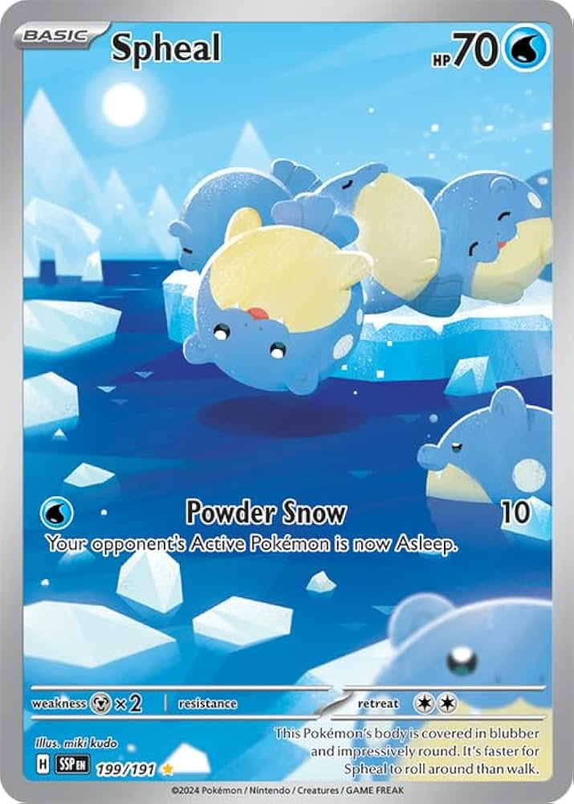
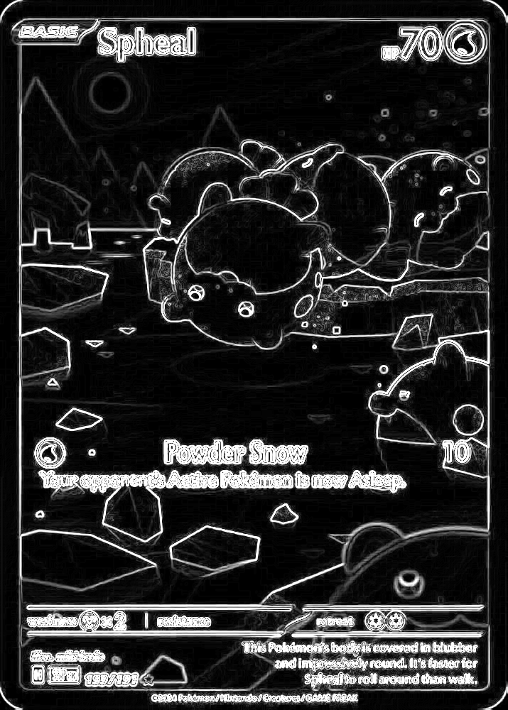

# imgproxide

## image processing functions in rust

this is a repository where I am implementing a few image processing functions into rust.

### Features
- Custom Kernel Engine
    - With Dynamic 2D Gaussian Kernel support
- Edge Detection Pipeline 

### currently implementing / wip

- Denoising Pipeline
- HOGS (histogram of oriented gradients)

### Results

| Input Image | Sobel Edge Detection |
|:---:|:---:|
|  |  |
| *Original Spheal Card* | *Gaussian Blur + Sobel Magnitude* |
